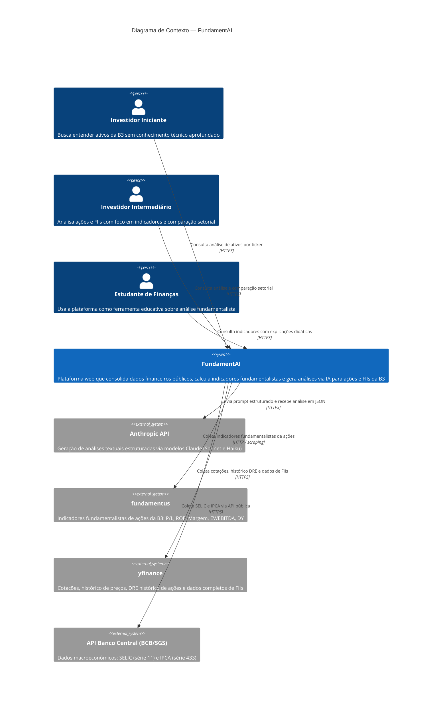

# C4 — Nível 1: Contexto

> **Pergunta respondida:** O que é o sistema e quem o usa?

---

## Elementos pendentes de implementação

Nenhum. Todos os sistemas externos e personas representados neste nível já estão integrados ou definidos no projeto.

---

## Revisão técnica

- **Decisões de design representadas:**
  - O sistema é apresentado como uma unidade coesa — detalhe interno omitido intencionalmente neste nível.
  - As três personas refletem os perfis definidos no `docs/PRD.md` (seção 1.3).
  - `fundamentus` e `yfinance` são fontes distintas com responsabilidades complementares: `fundamentus` cobre indicadores de ações; `yfinance` cobre FIIs (exclusivo) e histórico DRE de ações.
  - A API do BCB é representada como sistema externo independente, não agrupada com as demais fontes financeiras, pois fornece contexto macroeconômico — não dados de ativos.

- **Limitações deste diagrama:**
  - Não distingue os containers internos do FundamentAI (frontend, API, ETL, banco).
  - Não mostra frequência ou direção temporal das integrações (ex: ETL diário vs. consulta sob demanda).
  - O disclaimer de não-recomendação de investimento não é representável em C4 — pertence à documentação de produto.

- **O que será detalhado no Nível 2 (Container):**
  - Decomposição interna do FundamentAI em: Frontend React, API FastAPI, ETL Scheduler, banco de dados e módulo de prompts.
  - Protocolos e direção das comunicações entre os containers.
  - Identificação dos componentes do frontend ainda não implementados (marcados com `*`).
