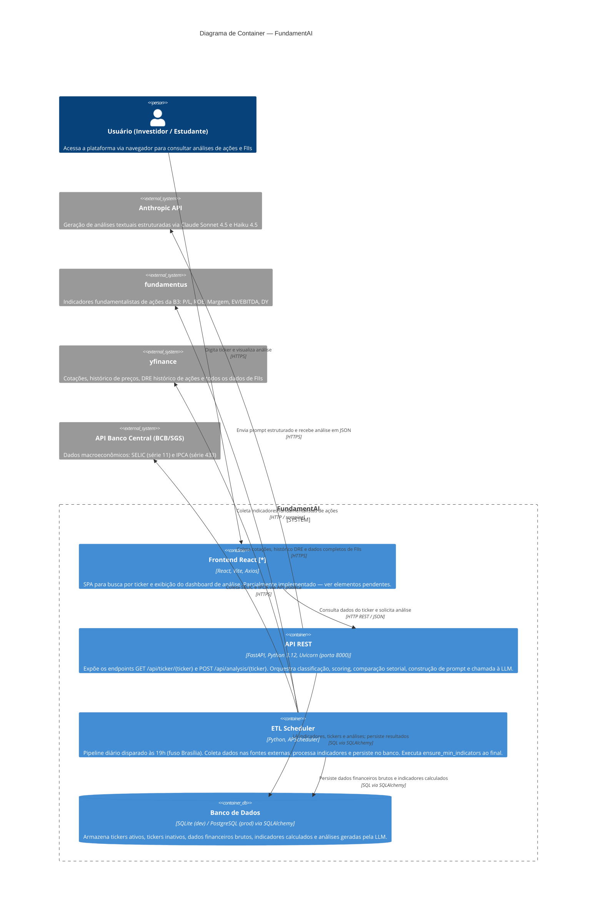

# C4 — Nível 2: Container

> **Pergunta respondida:** Como o sistema está dividido tecnicamente?

---

## Elementos pendentes de implementação

Os itens marcados com `*` ainda não existem no repositório e precisam ser criados.

| Elemento | Localização esperada | Descrição |
|---|---|---|
| `Home [*]` | `frontend/src/pages/Home/` | Página inicial com campo de busca por ticker — ponto de entrada da aplicação |
| `ScoreCard [*]` | `frontend/src/components/ScoreCard/` | Componente de exibição do score (0–100) e classificação qualitativa (Excelente / Bom / Regular / Fraco) |
| `IndicatorTable [*]` | `frontend/src/components/IndicatorTable/` | Tabela de indicadores fundamentalistas com tooltips explicativos por tipo de ativo |
| `Chart [*]` | `frontend/src/components/Chart/` | Gráficos de histórico de preços, evolução de indicadores e comparação setorial |
| `Verdict [*]` | `frontend/src/components/Verdict/` | Componente de exibição do veredito, pontos positivos/negativos e conclusão gerados pela IA |
| `hooks/ [*]` | `frontend/src/hooks/` | Custom hooks React para encapsular lógica de busca, estado e formatação |
| `utils/ [*]` | `frontend/src/utils/` | Funções auxiliares de formatação de números, datas e tratamento de erros da API |

> O container **Frontend React** existe e está funcional como scaffold (`App.jsx`, `Analysis.jsx`, `services/api.js`), mas depende da criação dos itens acima para atender os requisitos funcionais definidos no PRD.

---

## Revisão técnica

- **Decisões de design representadas:**
  - O **ETL Scheduler** é um container independente da API — não compartilha processo com o FastAPI. Isso permite escalar e reiniciar cada um separadamente.
  - A **API REST** é stateless: todo o estado persiste no banco via SQLAlchemy, o que viabiliza escalabilidade horizontal futura.
  - O **Banco de Dados** é representado como container único com dois modos (SQLite/PostgreSQL) — a abstração SQLAlchemy garante que nenhum SQL vendor-specific existe no código da aplicação.
  - A chamada à **Anthropic API** parte exclusivamente da API REST (sob demanda), nunca do ETL — o ETL apenas coleta e processa dados financeiros.
  - O **Frontend** se comunica apenas com a API REST, nunca diretamente com fontes externas ou banco — arquitetura de separação de responsabilidades preservada.

- **Limitações deste diagrama:**
  - O módulo `backend/prompts/builder.py` não aparece como container separado — é um componente interno da API REST, detalhado no Nível 3.
  - O `ensure_min_indicators` e demais scripts de manutenção são subprocessos do ETL, não containers independentes.
  - Não representa autenticação de usuário — fora do escopo do MVP conforme PRD.

- **O que será detalhado no Nível 3 (Componente):**
  - Decomposição interna do container **API REST** em seus componentes: rotas, processors (`asset_classifier`, `indicators`, `scoring`, `comparator`), `db/repository` e `prompts/builder`.
  - Identificação de quaisquer componentes previstos na arquitetura mas ainda ausentes no código.
