# C4 — Nível 3: Componente

> **Pergunta respondida:** O que existe dentro do container API REST?

```mermaid
C4Component
  title Diagrama de Componente — API REST (FundamentAI)

  Container_Boundary(api, "API REST — FastAPI (porta 8000)") {

    Component(routeTicker, "Rota Ticker", "FastAPI Router — routes/ticker.py", "GET /api/ticker/{ticker} — valida ticker, classifica tipo, coleta dados sob demanda, calcula score e retorna TickerResponse unificado")
    Component(routeAnalysis, "Rota Analysis", "FastAPI Router — routes/analysis.py", "POST /api/analysis/{ticker} — orquestra coleta, processamento, comparação setorial, prompt e chamada à LLM; gerencia cache de análises por 24h")

    Component(classifier, "Asset Classifier", "Python — processors/asset_classifier.py", "Classifica ticker como stock/fii pelo b3_type; detecta e persiste tickers inativos")
    Component(indicators, "Indicators Calculator", "Python — processors/indicators.py", "Calcula todos os indicadores por tipo de ativo (ROE, Margem, P/L, P/VP, DY, CAGR etc.)")
    Component(scoring, "Scoring Engine", "Python — processors/scoring.py", "Calcula score 0–100 com pesos específicos por tipo de ativo; retorna output unificado com label e breakdown")
    Component(comparator, "Sector Comparator", "Python — processors/comparator.py", "Busca empresas do mesmo setor, calcula médias e compara indicadores do ativo com a média setorial")
    Component(validator, "Data Validator", "Python — processors/data_validator.py", "Valida e sanitiza dados brutos coletados das fontes externas antes do processamento")
    Component(promptBuilder, "Prompt Builder", "Python — prompts/builder.py", "Monta prompt estruturado (system + user) com indicadores, contexto macro, score e comparação setorial; versiona templates (v1.0.0)")
    Component(repository, "Repository", "SQLAlchemy — db/repository.py", "CRUD e upsert para Ticker, InactiveTicker, FinancialData, Indicators e Analysis; abstrai acesso ao banco")

    Component(colFundamentus, "Collector: fundamentus", "Python — collectors/fundamentus.py", "Coleta indicadores fundamentalistas de ações da B3 via fundamentus")
    Component(colYfinance, "Collector: yfinance", "Python — collectors/yfinance.py + income_history.py", "Coleta cotações, histórico de preços e DRE histórico de ações via yfinance")
    Component(colFii, "Collector: FII", "Python — collectors/fii.py", "Coleta todos os dados de FIIs exclusivamente via yfinance")
    Component(colBacen, "Collector: BCB", "Python — collectors/bacen.py", "Coleta SELIC (série 11) e IPCA (série 433) via API pública do Banco Central")
  }

  ContainerDb(db, "Banco de Dados", "SQLite / PostgreSQL via SQLAlchemy", "Tickers, indicadores, dados financeiros e análises")
  System_Ext(anthropic, "Anthropic API", "Claude Sonnet 4.5 / Haiku 4.5")
  System_Ext(fundamentusSrc, "fundamentus", "Fonte externa de indicadores de ações")
  System_Ext(yfinanceSrc, "yfinance", "Fonte externa de cotações, DRE e dados de FIIs")
  System_Ext(bcbSrc, "API BCB / SGS", "Fonte externa de dados macroeconômicos")

  Rel(routeTicker, classifier, "Classifica tipo e verifica inativos")
  Rel(routeTicker, colFundamentus, "Coleta indicadores de ações sob demanda")
  Rel(routeTicker, colYfinance, "Coleta cotação e histórico de preços")
  Rel(routeTicker, colFii, "Coleta dados de FIIs sob demanda")
  Rel(routeTicker, validator, "Valida dados coletados")
  Rel(routeTicker, indicators, "Calcula indicadores por tipo")
  Rel(routeTicker, scoring, "Calcula score 0–100")
  Rel(routeTicker, repository, "Persiste ticker, financials e indicadores (upsert)")

  Rel(routeAnalysis, colFundamentus, "Coleta indicadores para montar prompt")
  Rel(routeAnalysis, colYfinance, "Coleta cotação e demonstrativos")
  Rel(routeAnalysis, colBacen, "Coleta SELIC e IPCA para contexto macro")
  Rel(routeAnalysis, indicators, "Calcula indicadores")
  Rel(routeAnalysis, scoring, "Calcula score")
  Rel(routeAnalysis, comparator, "Compara com média do setor (best-effort)")
  Rel(routeAnalysis, promptBuilder, "Monta prompt estruturado")
  Rel(routeAnalysis, repository, "Verifica cache e persiste análise gerada")

  Rel(promptBuilder, anthropic, "Envia system + user prompt; recebe análise em JSON", "HTTPS")

  Rel(colFundamentus, fundamentusSrc, "Scraping de indicadores", "HTTP")
  Rel(colYfinance, yfinanceSrc, "Download de dados históricos e cotações", "HTTPS")
  Rel(colFii, yfinanceSrc, "Download de dados de FIIs", "HTTPS")
  Rel(colBacen, bcbSrc, "Consulta séries temporais SGS", "HTTPS")

  Rel(repository, db, "Lê e grava via SQLAlchemy ORM", "SQL")
```

---

## Elementos pendentes de implementação

Nenhum componente interno da API REST está pendente — todos os módulos listados no diagrama existem no repositório. Abaixo, os componentes **planejados na arquitetura mas sem endpoint dedicado** na API atual:

| Elemento | Situação | Observação |
|---|---|---|
| `Endpoint GET /api/sector/{sector}` | Não existe como rota dedicada | A comparação setorial é executada internamente pela `Rota Analysis`; não há endpoint público para consultar médias setoriais isoladamente |
| Tooltips / explicações de indicadores | Ausente no backend | A US-05 prevê explicações didáticas por indicador — hoje a explicação é gerada pela LLM dentro da análise, não como endpoint independente |

> Os **Collectors** estão dentro do boundary da API neste diagrama por serem componentes do mesmo pacote Python. São, contudo, **compartilhados com o ETL Scheduler** — que os invoca de forma agendada. Isso será detalhado na revisão técnica abaixo.

---

## Revisão técnica

- **Decisões de design representadas:**
  - As rotas (`routeTicker` e `routeAnalysis`) são os únicos pontos de entrada externos — toda lógica de negócio é delegada aos processors, nunca implementada nas rotas.
  - O `Prompt Builder` é o único componente que se comunica com a Anthropic API, isolando o acoplamento com a LLM em um único lugar versionado.
  - O `Repository` é o único componente que acessa o banco, garantindo separação de responsabilidades entre lógica de negócio e persistência.
  - Os Collectors são módulos stateless e reutilizáveis, chamados sob demanda pelas rotas (API) e de forma agendada pelo ETL — sem duplicação de lógica.
  - O cache de análises (TTL de 24h) é gerenciado diretamente pela `Rota Analysis` via `repository`, evitando chamadas desnecessárias à Anthropic API.

- **Limitações deste diagrama:**
  - O `data_validator.py` existe no repositório mas não aparece com uso explícito nas rotas lidas — pode estar em fase de integração.
  - O diagrama não expande o container **ETL Scheduler**, que também usa os Collectors e os Processors — fica como oportunidade para um diagrama complementar.
  - A lógica de fallback entre fontes (ex: `yfinance` como alternativa ao `fundamentus` quando indisponível) não é visível em diagramas C4 — pertence ao nível de código.

- **O que será detalhado no Nível 4 (Código):**
  - Diagrama de classes (`classDiagram`) das entidades do banco: `Ticker`, `InactiveTicker`, `FinancialData`, `Indicators` e `Analysis`.
  - Atributos, tipos de dados e relacionamentos definidos em `backend/db/models.py`.
  - Identificação de atributos previstos no PRD mas ainda ausentes no modelo.
