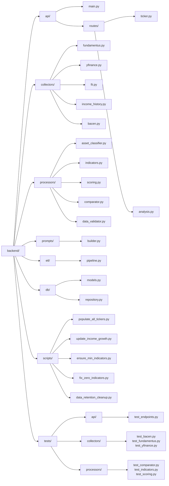
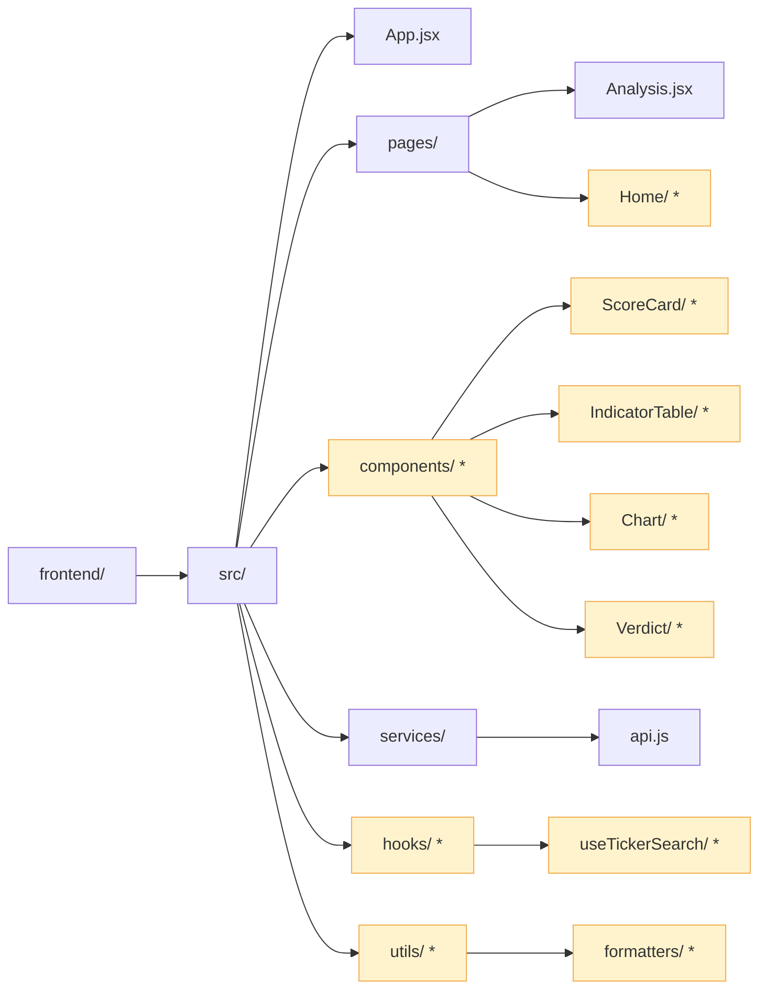

# C4 — Nível 4: Código (Estrutura de Diretórios)

> **Pergunta respondida:** Como o código está organizado fisicamente no repositório?

> `*` indica arquivos ou diretórios **ainda não criados** — pendentes de implementação.

---

## Estrutura de Diretórios

```
FundamentAI/
├── backend/
│   ├── api/
│   │   ├── main.py
│   │   └── routes/
│   │       ├── ticker.py
│   │       └── analysis.py
│   ├── collectors/
│   │   ├── fundamentus.py
│   │   ├── yfinance.py
│   │   ├── fii.py
│   │   ├── income_history.py
│   │   └── bacen.py
│   ├── processors/
│   │   ├── asset_classifier.py
│   │   ├── indicators.py
│   │   ├── scoring.py
│   │   ├── comparator.py
│   │   └── data_validator.py
│   ├── prompts/
│   │   └── builder.py
│   ├── etl/
│   │   └── pipeline.py
│   ├── db/
│   │   ├── models.py
│   │   └── repository.py
│   ├── scripts/
│   │   ├── populate_all_tickers.py
│   │   ├── update_income_growth.py
│   │   ├── ensure_min_indicators.py
│   │   ├── fix_zero_indicators.py
│   │   └── data_retention_cleanup.py
│   └── tests/
│       ├── api/
│       │   └── test_endpoints.py
│       ├── collectors/
│       │   ├── test_bacen.py
│       │   ├── test_fundamentus.py
│       │   └── test_yfinance.py
│       └── processors/
│           ├── test_comparator.py
│           ├── test_indicators.py
│           └── test_scoring.py
├── frontend/
│   └── src/
│       ├── App.jsx
│       ├── pages/
│       │   ├── Analysis.jsx
│       │   └── Home/              *
│       ├── components/            *
│       │   ├── ScoreCard/         *
│       │   ├── IndicatorTable/    *
│       │   ├── Chart/             *
│       │   └── Verdict/           *
│       ├── services/
│       │   └── api.js
│       ├── hooks/                 *
│       └── utils/                 *
├── docs/
└── .kiro/
    └── steering/
        ├── product.md
        ├── tech.md
        └── structure.md
```

---

### Backend



---

### Frontend



---

## Elementos pendentes de implementação

| Elemento | Localização esperada | Descrição |
|---|---|---|
| `Home/ *` | `frontend/src/pages/Home/` | Página inicial com campo de busca por ticker |
| `ScoreCard/ *` | `frontend/src/components/ScoreCard/` | Componente de exibição do score e classificação qualitativa |
| `IndicatorTable/ *` | `frontend/src/components/IndicatorTable/` | Tabela de indicadores com tooltips explicativos por tipo de ativo |
| `Chart/ *` | `frontend/src/components/Chart/` | Gráficos de histórico de preços e comparação setorial |
| `Verdict/ *` | `frontend/src/components/Verdict/` | Veredito, pontos positivos/negativos e conclusão da IA |
| `hooks/ *` | `frontend/src/hooks/` | Custom hooks React para lógica de busca e estado |
| `utils/ *` | `frontend/src/utils/` | Funções auxiliares de formatação e tratamento de erros |

---

## Revisão técnica

- **Decisões de design representadas:**
  - A separação em `collectors/`, `processors/`, `prompts/`, `etl/`, `api/` e `db/` reflete o princípio de responsabilidade única — cada camada tem uma função bem definida e pode ser testada, substituída ou escalada de forma independente.
  - Os `scripts/` são executáveis de manutenção separados do fluxo principal da API e do ETL, evitando que operações pontuais (ex: reprocessamento de tickers) afetem o serviço em produção.
  - Os `tests/` espelham a estrutura de `collectors/` e `processors/` — facilita localizar o teste de qualquer módulo sem navegação extra.
  - O frontend segue a convenção React de `pages/` (rotas) + `components/` (reutilizáveis) + `services/` (comunicação externa) — padrão amplamente adotado que separa lógica de apresentação, lógica de negócio e acesso a dados.

- **Diferença em relação ao diagrama de classes (c4-nivel-4-codigo.md):**
  - O diagrama de classes foca nas **entidades de domínio** (atributos, tipos, relacionamentos do banco).
  - Este diagrama foca na **organização física do código** (onde cada responsabilidade vive no sistema de arquivos).
  - Ambos são representações válidas do Nível 4 no C4 Model e se complementam.
