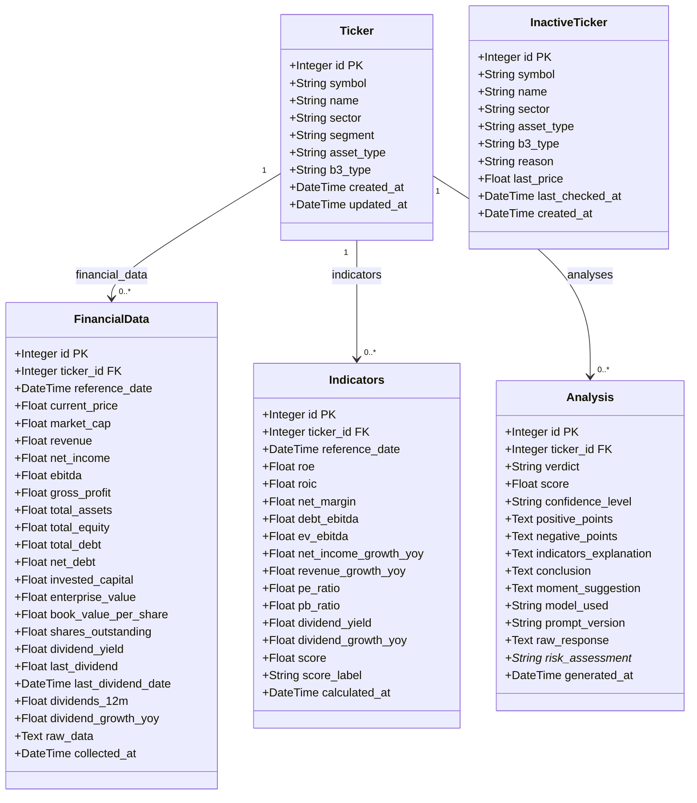

# C4 — Nível 4: Código

> **Pergunta respondida:** Como o código está estruturado na camada de persistência?

> `*` Atributo previsto no PRD e no schema de resposta da API (`AnalysisResponse`), mas **ainda não implementado** na tabela `analyses` do banco de dados — ver elementos pendentes abaixo.

---

## Elementos pendentes de implementação

| Elemento | Localização esperada | Descrição |
|---|---|---|
| `risk_assessment*` | `Analysis.risk_assessment` — coluna `String` em `backend/db/models.py` | Campo presente no `AnalysisResponse` (Pydantic) e retornado pela API, mas não persistido na tabela `analyses`. A avaliação de risco gerada pela LLM é descartada após cada requisição — não fica disponível para consultas históricas. |

---

## Revisão técnica

- **Decisões de design representadas:**
  - `Ticker` é a entidade central: `FinancialData`, `Indicators` e `Analysis` são dependentes e possuem cascade `all, delete-orphan` — excluir um `Ticker` remove todos os seus dados associados.
  - `InactiveTicker` é uma entidade independente, sem relacionamento com `Ticker` — garante que um ticker inativo nunca coexista com um ticker ativo no sistema.
  - `FinancialData` e `Indicators` possuem campos separados por tipo de ativo (`ações` vs `FIIs`), mas estão na mesma tabela — design intencional para manter o output unificado e simplificar o ORM.
  - O campo `raw_data` em `FinancialData` (JSON/Text) oferece flexibilidade para preservar dados brutos sem exigir migrations imediatas ao adicionar novas fontes.
  - `Analysis` armazena `positive_points`, `negative_points` e `indicators_explanation` como `Text` (JSON serializado) — evita tabelas auxiliares para listas, ao custo de não permitir queries SQL nesses campos.
  - O campo `score` existe tanto em `Indicators` (calculado localmente pelos processors) quanto em `Analysis` (retornado pela LLM) — os dois podem divergir e são tratados como fontes independentes.

- **Limitações deste diagrama:**
  - Não representa índices de banco (`index=True`) nem restrições de unicidade (`unique=True`) — detalhes relevantes para performance em produção (PostgreSQL).
  - O campo `reference_date` em `FinancialData` e `Indicators` funciona como chave de série temporal — o diagrama não representa a constraint de unicidade composta `(ticker_id, reference_date)`.
  - Não cobre as funções auxiliares do módulo (`create_tables`, `get_db`, `SessionLocal`) — são infraestrutura, não entidades de domínio.

- **Considerações para evolução do modelo:**
  - Adicionar `risk_assessment` como coluna em `Analysis` para persistir o campo já retornado pela API.
  - Avaliar a extração de `positive_points` e `negative_points` para uma tabela própria (`analysis_points`) caso seja necessário filtrar ou agregar por ponto individualmente.
  - Considerar uma tabela `sector_averages` para cachear médias setoriais calculadas pelo `comparator`, evitando recálculo a cada requisição de análise.
