# FundamentAI — Estrutura de Previews das Telas

Mapeamento das seções de design e seus respectivos arquivos de imagem localizados na pasta `docs/`.

---

## Tabela de Previews

| Seção | Arquivo | Descrição |
|---|---|---|
| Tela 1 — Home / Landing Page | `docs/tela-home.png` | Headline, barra de busca com chips de exemplo e 3 cards de features |
| Tela 2 — Dashboard de Análise | `docs/Telas1/1.Analise.png` | Grid 2 colunas: indicadores, score, diagnóstico da IA e histórico de preços |
| Tela 3 — Loading | `docs/Telas1/2.Loading.png` | Spinner animado e etapas de progresso (Coletar → Calcular → IA) |
| Tela 4 — Aviso / Erro | `docs/Telas1/3.AvisoError.png` | Feedback para ticker não encontrado, ativo inativo ou erro de conexão |
| Tela 5 — Indicadores por Tipo de Ativo | `docs/Telas1/4.Indicadores.png` | Card com badge AÇÃO (teal) ou FII (roxo) e indicadores específicos por tipo |
| Mockup Geral | `docs/Telas1/0.gMock.jpeg` | Visão geral do produto com todas as telas e fluxo de navegação |
| Wireframe 1 | `docs/Telas2/wireframe1.png` | Wireframe da tela Home |
| Wireframe 2 | `docs/Telas2/wireframe2.png` | Wireframe do Dashboard |
| Wireframe 3 | `docs/Telas2/wireframe3.png` | Wireframe da tela de Loading |
| Wireframe 4 | `docs/Telas2/wireframe4.png` | Wireframe da tela de Erro |
| Wireframe 5 | `docs/Telas2/wireframe5.png` | Wireframe dos Indicadores |
| Mock 6 | `docs/Telas2/mock6.png` | Mockup refinado — variação 6 |
| Mock 7 | `docs/Telas2/mock7.png` | Mockup refinado — variação 7 |
| Mock 8 | `docs/Telas2/mock8.png` | Mockup refinado — variação 8 |
| Mock 9 | `docs/Telas2/mock9.png` | Mockup refinado — variação 9 |
| Todas as Telas | `docs/Telas2/todasTelas.png` | Visão consolidada de todas as telas |

---

## Previews

### Tela 1 — Home / Landing Page

Identidade visual dark premium com barra de busca centralizada, chips de ticker e cards de features.

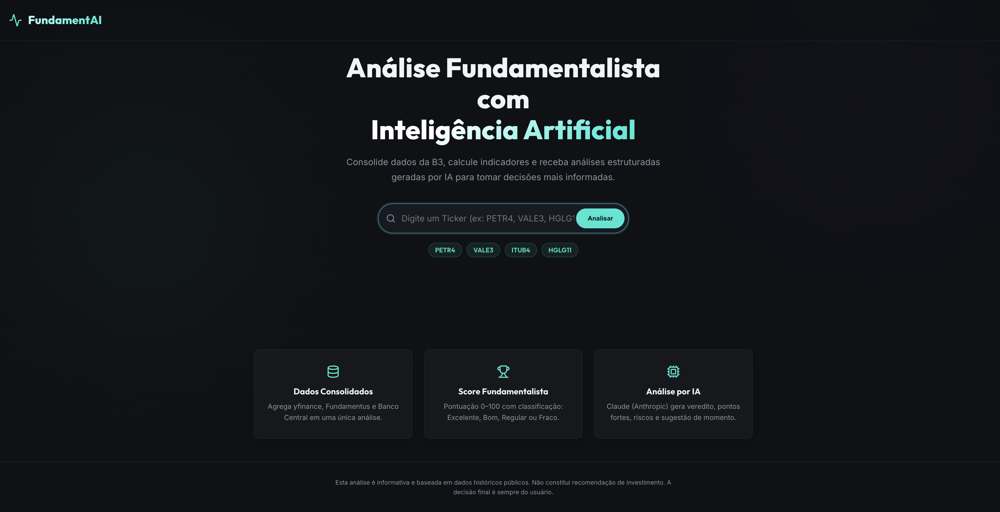

---

### Tela 2 — Dashboard de Análise

Dashboard com grid 2 colunas: Score Fundamentalista, indicadores chave e gráficos de evolução de preço.

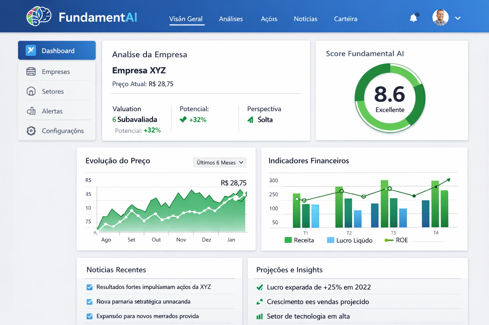

---

### Tela 3 — Loading

Fundo dark premium com gradiente teal/roxo, spinner circular animado e texto "Processando Inteligência de Mercado..." centralizado.

---

### Tela 4 — Aviso / Erro

Estilo dark premium com ícone de alerta, título "Ticker Inativo ou Indisponível" e botão de ação. Mantém consistência visual com o restante do produto.

---

### Tela 5 — Indicadores por Tipo de Ativo

Card com abas de seleção por tipo de ativo (Ações, FIIs), indicadores com ícone, valor e descrição em cores distintas. Aba ativa destacada em teal.

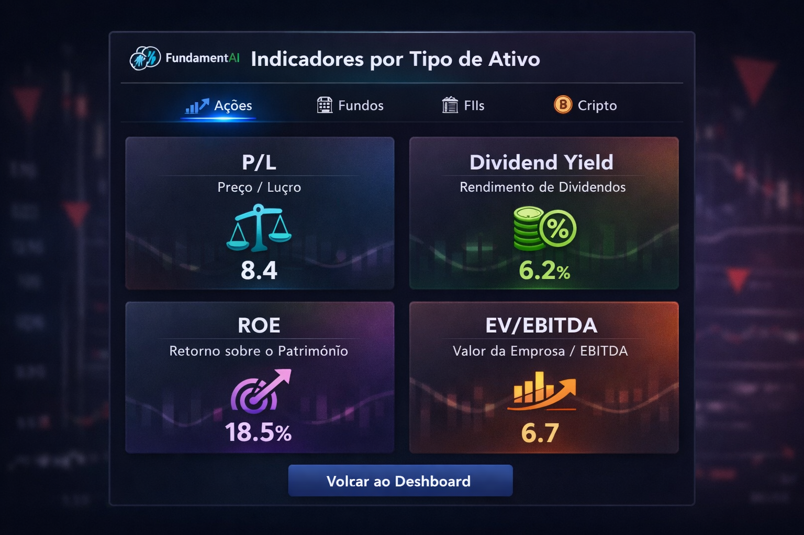

---

### Mockup Geral

Visão geral do produto com todas as telas e fluxo de navegação.

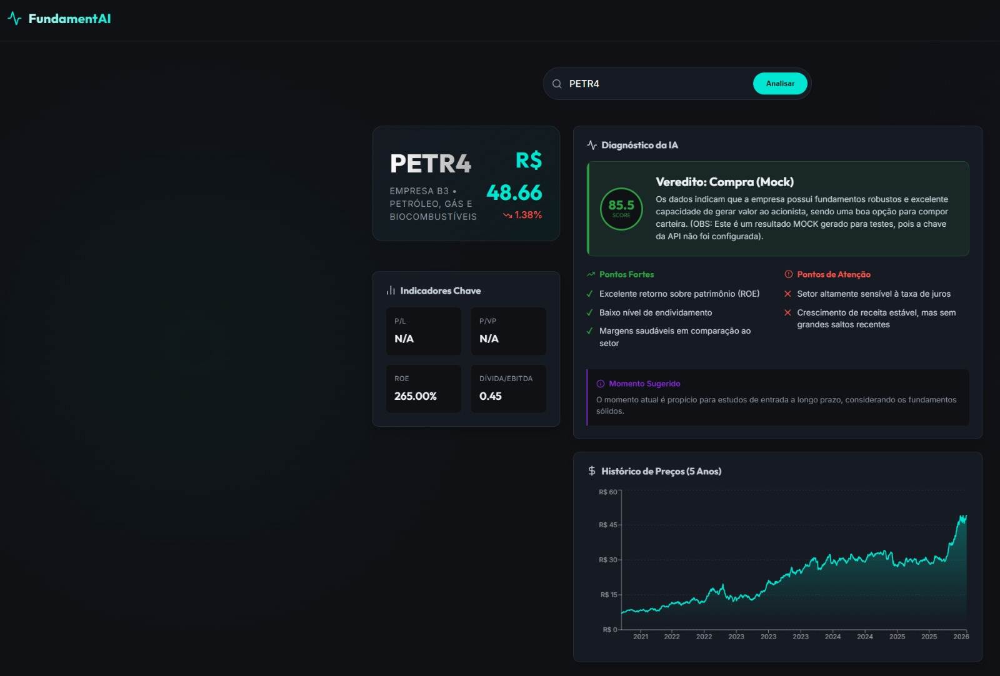

---

### Wireframes (Telas2)

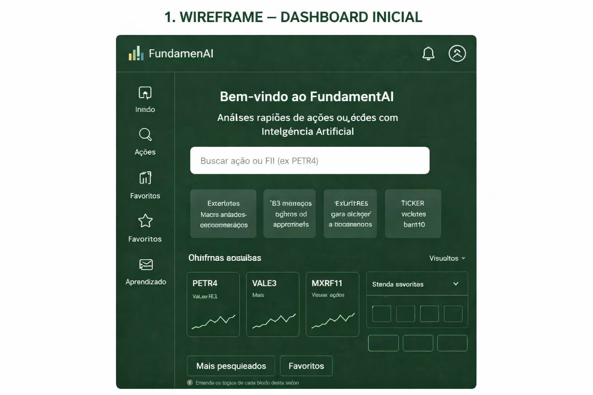

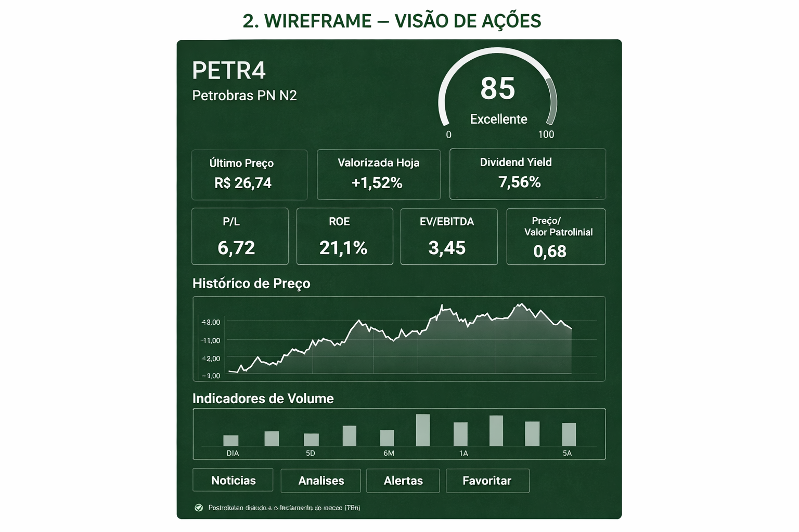

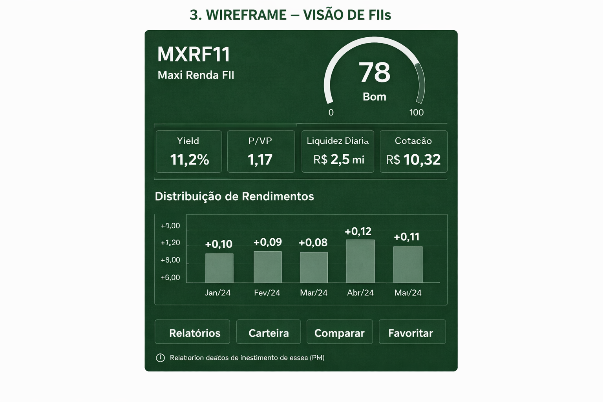

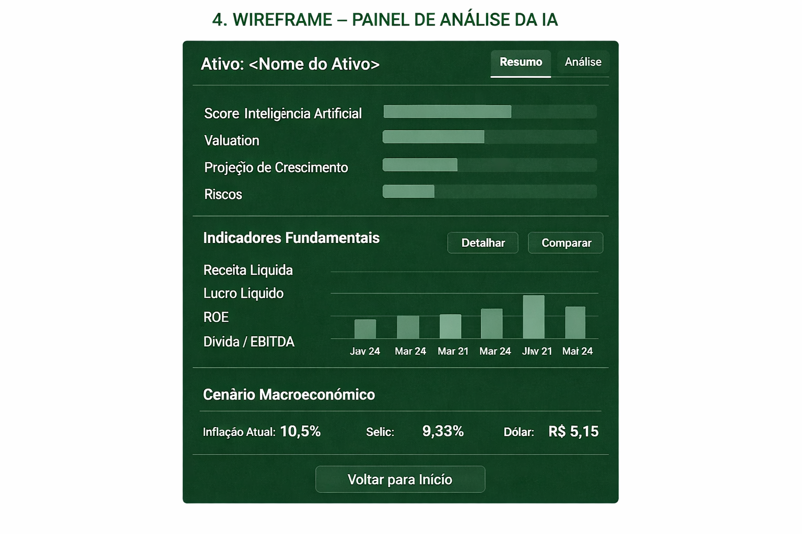

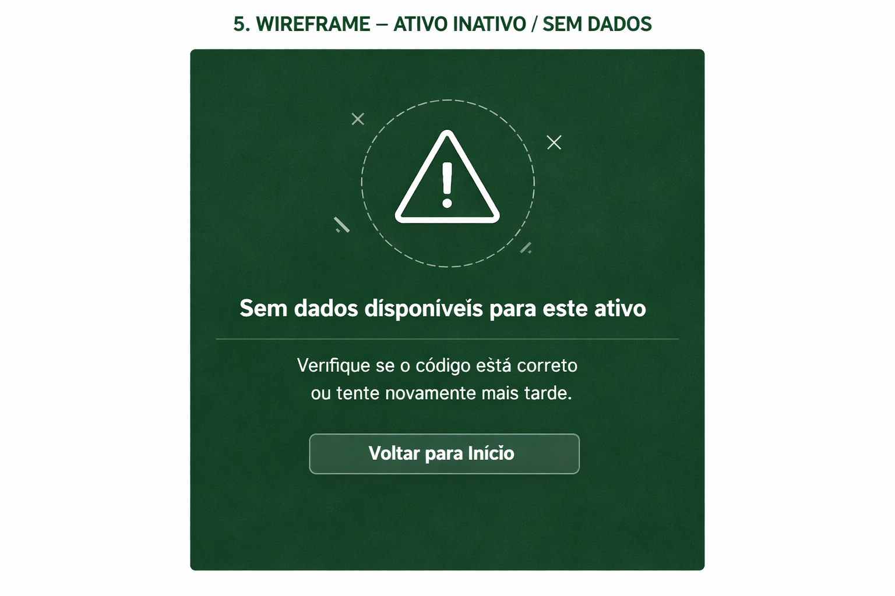

---

### Mockups Refinados (Telas2)

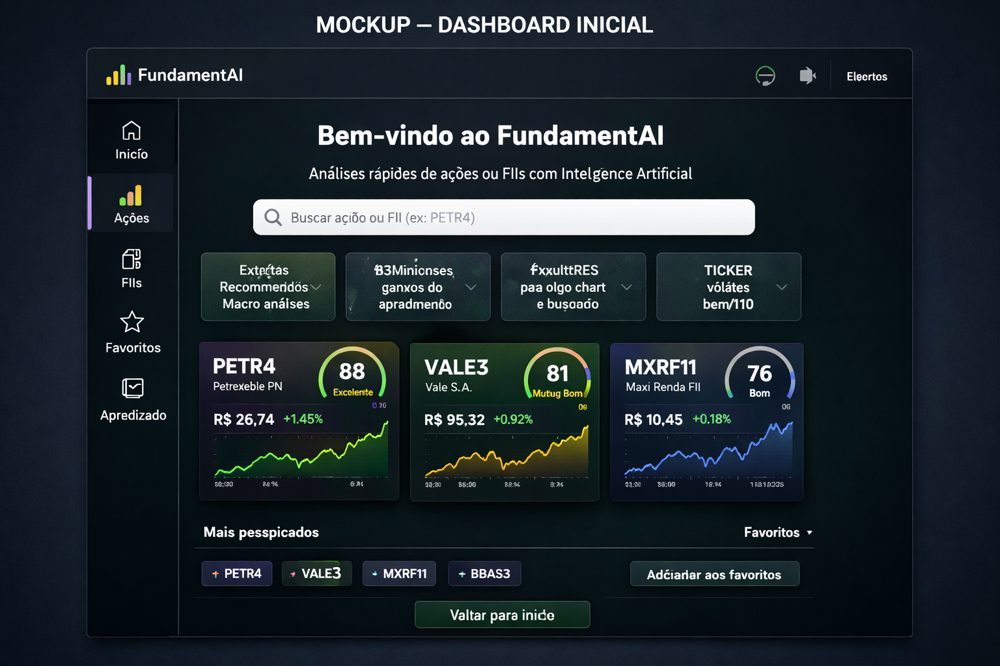

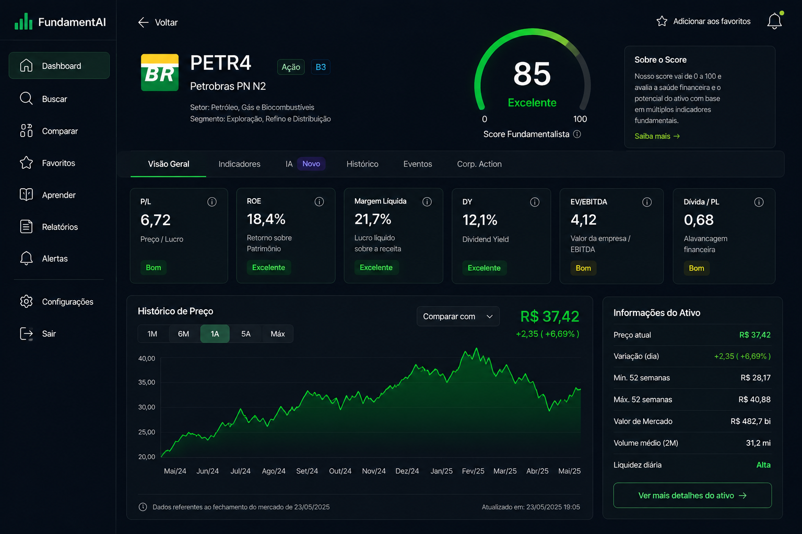

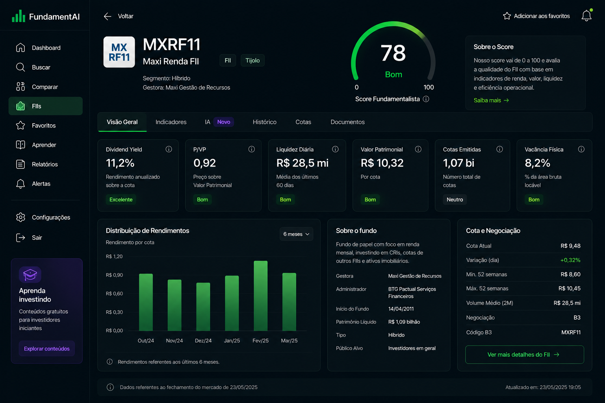

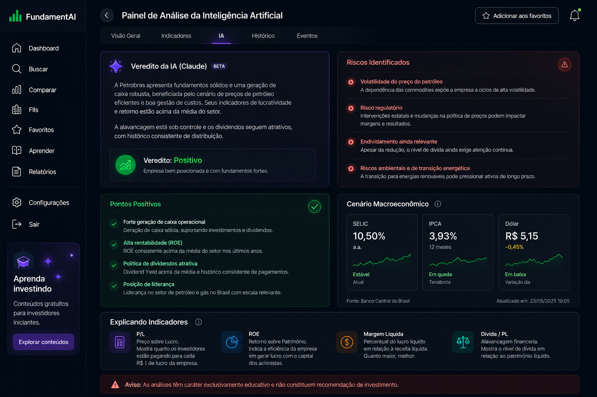

---

### Todas as Telas

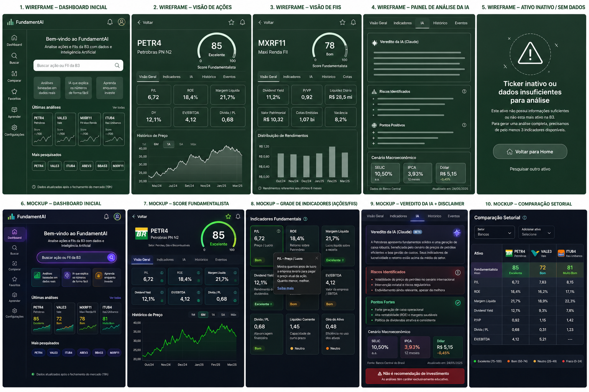

---

## Referências

- Script completo de prompts de design: [`TELA1.md`](../TELA1.md)
- Paleta de cores e identidade visual: ver seção "Paleta de Cores" em `TELA1.md`
- Componentes implementados: `frontend/src/components/` e `frontend/src/pages/`
